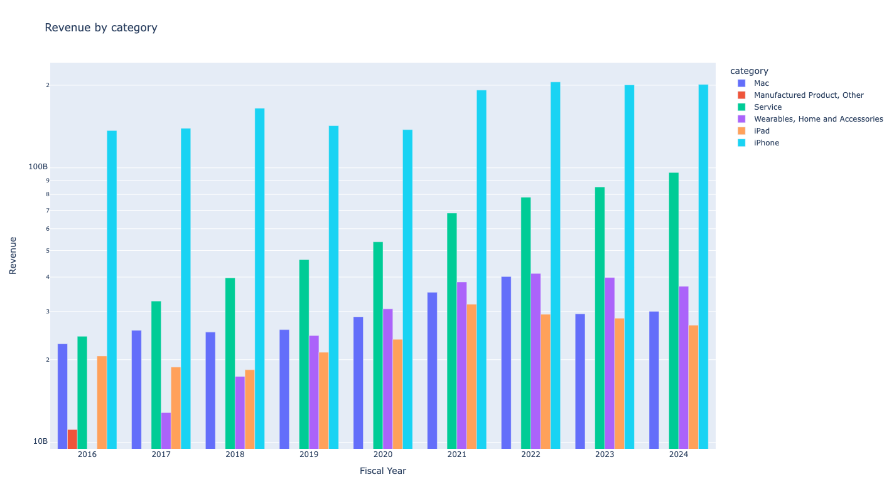
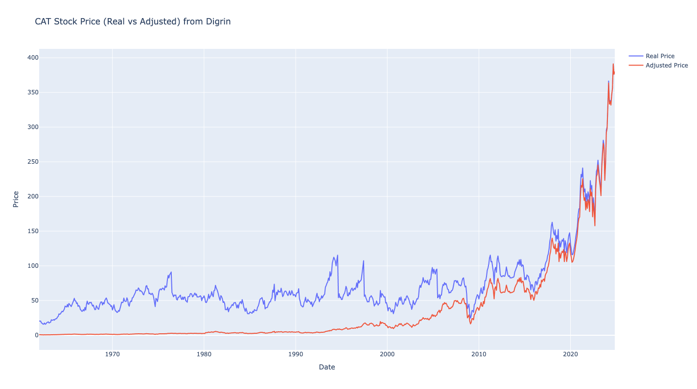
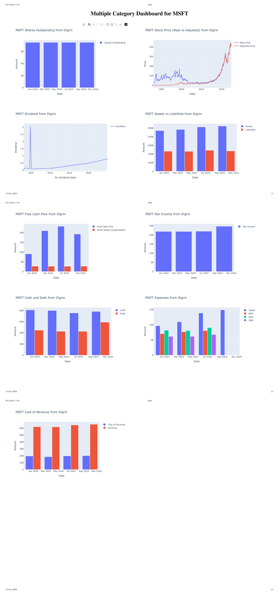

[](https://github.com/ahnazary/stockdex/actions/workflows/publish-package.yaml)
[](https://badge.fury.io/py/stockdex)


[](https://ahnazary.github.io/stockdex/)

<!-- <p align="center">
  
</p> -->


# Stock Data Extractor (Stockdex)

Stockdex is a Python package that provides a simple interface to access financial data from various sources and plotting capabilities using Plotly.

<br />


# Advantages of `Stockdex` over similar packages

- **Various data sources**: `Stockdex` provides data from Yahoo Finance API and website, Digrin, Finviz, Macrotrends and JustETF (for EU ETFs).

- **Numerous data categories**: `Stockdex` provides various data including financial statements, earnings, dividends, stock splits, list of key executives, major shareholders, and many more.

- **Historical data**: `Stockdex` provides a wide time range of data, e.g. Digrin and Macrotrends sources, which provide data ranging from 4 years to historical data.

- <span style="font-size: 17px; font-weight: bold; animation: rainbow 1.8s infinite; background: linear-gradient(90deg, orange, green, blue, indigo, violet); background-size: 13
 00%; -webkit-background-clip: text; -webkit-text-fill-color: transparent;">**plotting capabilities (new feature)**</span>: `Stockdex` provides plotting financial data using bar, line, and sanky plots. Multiple plots can be combined in dash app.

<!-- <style>
@keyframes rainbow {
  0% { background-position: 0% 50%; }
  50% { background-position: 100% 50%; }
  100% { background-position: 0% 50%; }
}
</style> -->

<br />

# Installation 

Install the package using pip:

```bash
pip install stockdex -U --no-cache-dir
``` 
<br />

# Usage

For detailed info about usage of the package and its functions including plotting and dash app, check out the [this part of the readme](USAGE.md).

In general, to access main functions, The `Ticker` object should be created with the ticker of the stock as an argument. An example of creating a `Ticker` object is shown below:

```python
from stockdex import Ticker

ticker = Ticker(ticker="AAPL")
```

## Data from `Yahoo Finance`, `Digrin`, `Macrotrends` and `Finviz`:

The `Ticker` object provides data from Yahoo Finance API and website, Digrin, and Macrotrends. Below are some of the data that can be retrieved from these sources (more detailed info with output can be found [here](USAGE.md)).

### Raw data:
```python
from stockdex import Ticker
from datetime import datetime

ticker = Ticker(ticker="AAPL")

# Price data (use range and dataGranularity to make range and granularity more specific) from Yahoo Finance API
price = ticker.yahoo_api_price(range='1y', dataGranularity='1d')

# plot financial data using Plotly
ticker = Ticker(ticker="MSFT")
ticker.plot_yahoo_api_financials(group_by="field")

# Complete historical data of the stock in certain categories from digrin website
dividend = ticker.digrin_dividend

# Financial data from macrotrends website
income_statement = ticker.macrotrends_income_statement

# Summary including general financial information from Yahoo Finance website
summary = ticker.yahoo_web_summary

# Quarterly and yearly revenue data from macrotrends website
quarterly_revenue = ticker.macrotrends_revenue(frequency='quarterly')
annual_revenue = ticker.macrotrends_revenue(frequency='annual')

# Dividend data from Finviz
dividends = ticker.finviz_dividends_date_data()
dividends_annual = ticker.finviz_dividends_annual_data()

# Revenue data from Finviz
revenue_by_products = ticker.finviz_revenue_by_products_and_services()
revenue_by_segments = ticker.finviz_revenue_by_segment()
revenue_by_regions = ticker.finviz_revenue_by_regions()

# Earnings reaction data from Finviz
earnings_reaction = ticker.finviz_price_reaction_to_earnings_report()
```

<!-- ## NASDAQ data from `NASDAQ` website (web scraping): 

Data on NASDAQ website gets updated more frequently than Yahoo Finance data. Below are some of the data that can be retrieved from the NASDAQ website.

```python
# Data about quarterly and yearly earnings, updated on the same day as the earnings release (yahoo finance data is updated after a few days)

quarterly_earnings_surprise = ticker.quarterly_earnings_surprise
yearly_earnings_forecast = ticker.yearly_earnings_forecast
quarterly_earnings_forecast = ticker.quarterly_earnings_forecast

price_to_earnings_ratio = ticker.price_to_earnings_ratio
forecast_price_to_earnings__growth_rates = ticker.forecast_peg_rate
``` -->

## EU ETF data from `justETF` (web scraping):

For EU ETFS, the `isin` and `security_type` should be passed to the `Ticker` object. The `isin` is the International Securities Identification Number of the ETF and the `security_type` should be set to `etf`. Note that justETF has strict rate limiting, so it is recommended to use the data sparingly.

```python
from stockdex import Ticker

etf = Ticker(isin="IE00B4L5Y983", security_type="etf")

etf_general_info = etf.justetf_general_info
```
<br />

---

# Detailed usage instructions for the stockdex package

Below you will find available functions based on the source of the data. Each function is prefixed with the source of the data. For example functions with `yahoo_api_<function_name>` pattern are used to access data from Yahoo Finance API and functions with `yahoo_web_<function_name>` pattern are used to access data from Yahoo Finance website. Below are some examples of how to access data from different sources.

Functions prefixed with `plot` will use the `plotly` library to plot the data. The output of such functions is a plotly figure object. each plot function has a field called `show_plot`, default value is `True`, which when set to `False` will return the plotly figure object instead of showing the plot, this can be helpful plotting multiple figure in dashboards (such as dash). At the end of this document, you will find examples of how to use the functions to build complex dashboards. 


## Data from `Yahoo Finance` API:

### Raw data:

Following functions will return the data extracted from Yahoo Finance API in the form of a pandas DataFrame:

```python
from stockdex import Ticker
from datetime import datetime

ticker = Ticker(ticker="AAPL")

# Price data (use range and dataGranularity to make range and granularity more specific)
price = ticker.yahoo_api_price(range='1y', dataGranularity='1d')

# Current trading period of the stock (pre-market, regular, post-market trading periods)
current_trading_period = ticker.yahoo_api_current_trading_period

# Fundamental data (use frequency, format, period1 and period2 to fine-tune the returned data)
income_statement = ticker.yahoo_api_income_statement(frequency='quarterly')
cash_flow = ticker.yahoo_api_cash_flow(format='raw')
balance_sheet = ticker.yahoo_api_balance_sheet(period1=datetime(2020, 1, 1))
financials = ticker.yahoo_api_financials(period1=datetime(2022, 1, 1), period2=datetime.today())
```

### Plotting data:


#### Yahoo Finance
Following functions will plot the data extracted from Yahoo Finance API using the `plotly` library:

```python

from stockdex import Ticker

ticker = Ticker(ticker="MSFT")

ticker.plot_yahoo_api_financials(group_by="field")
ticker.plot_yahoo_api_income_statement(group_by="timeframe")
ticker.plot_yahoo_api_cash_flow(freq="quarterly")
ticker.plot_yahoo_api_balance_sheet(freq="quarterly")
``` 

Running each function will open a tab in default browser showing the plot:

<p align="center">
  
</p>

#### Finviz

Following functions will plot the data extracted from Finviz website using the `plotly` library:

```python
from stockdex import Ticker

ticker = Ticker(ticker="AAPL")

ticker.plot_finviz_revenue_by_products_and_services(log_scale=True)
ticker.plot_finviz_revenue_by_segment(log_scale=False)
ticker.plot_finviz_revenue_by_regions(log_scale=True)
```

Below the chart for `AAPL` revenue by products and services is shown in logarithmic scale:

<p align="center">
    
</p>

# Sankey charts:

Sankey charts are used to visualize the flow of cash in a company. The `plot_sankey_chart` function will plot a sankey chart based on data extracted from the Yahoo Finance API. Below is an example of how to plot a sankey chart for `AAPL` stock:

```python
from stockdex import Ticker

ticker = Ticker(ticker="AAPL")

ticker.plot_sankey_chart()
```

The output of the function is a sankey chart showing the income statement of the company. Hovering over the chart will show the amount of cash in each category. Below is the output for `AAPL` stock based on annual data:

<p align="center">
    
</p>


## Stocks data from `Digrin` (web scraping):

Data on Digrin website includes all historical data of the stock in certain categories, unlike Yahoo Finance which only provides the last 5 years of data at most.


### Raw data:

Following functions will return the data extracted from Digrin website in the form of a pandas DataFrame:

```python
from stockdex import Ticker

ticker = Ticker(ticker="AAPL")

# Complete historical data of the stock in certain categories
dividend = ticker.digrin_dividend
payout_ratio = ticker.digrin_payout_ratio
stock_splits = ticker.digrin_stock_splits
price = ticker.digrin_price

# Non-historical data
assets_vs_liabilities = ticker.digrin_assets_vs_liabilities
free_cash_flow = ticker.digrin_free_cash_flow
net_income = ticker.digrin_net_income
cash_and_debt = ticker.digrin_cash_and_debt
shares_outstanding = ticker.digrin_shares_outstanding
expenses = ticker.digrin_expenses
cost_of_revenue = ticker.digrin_cost_of_revenue
upcoming_estimated_earnings = ticker.digrin_upcoming_estimated_earnings

# Dividend data
dividend = ticker.digrin_dividend
dgr3 = ticker.digrin_dgr3
dgr5 = ticker.digrin_dgr5
dgr10 = ticker.digrin_dgr10
```

### Plotting data:

Following functions will plot the data extracted from Digrin website using the `plotly` library:

```python
from stockdex import Ticker

ticker = Ticker(ticker="ASML")

ticker.plot_digrin_shares_outstanding()
ticker.plot_digrin_price()
ticker.plot_digrin_dividend()
ticker.plot_digrin_assets_vs_liabilities()
ticker.plot_digrin_free_cash_flow()
ticker.plot_digrin_cash_and_debt()
ticker.plot_digrin_net_income()
ticker.plot_digrin_expenses()
ticker.plot_digrin_cost_of_revenue()
```

Running each function will open a tab in default browser showing the plot. Below the output for `ticker.plot_digrin_cash_and_debt()` is illustrated for `ASML` stock:

<p align="center">
  
</p>

Plots with too many data points are plotted as a line chart, instead of the default bar chart. Below is an example of a line chart for `CAT` stock historical price:

```python
from stockdex import Ticker

ticker = Ticker(ticker="CAT")

ticker.plot_digrin_price()
```

The output of the function is a line chart showing the historical price (real and adjusted) of the stock. Below is the output for `CAT` stock:

<p align="center">
  
</p>


## Stocks data from ``macrotrends`` (web scraping):

Data on Macrotrends website includes historical data in a span years. Below are some of the data that can be retrieved from the Macrotrends website.

### Raw data:

Following functions will return the data extracted from Macrotrends website in the form of a pandas DataFrame:

```python
from stockdex import Ticker

ticker = Ticker(ticker="AAPL")

# Financial data
income_statement = ticker.macrotrends_income_statement(frequency="quarterly")
balance_sheet = ticker.macrotrends_balance_sheet(frequency="quarterly")
cash_flow = ticker.macrotrends_cash_flow(frequency="annual")
key_financial_ratios = ticker.macrotrends_key_financial_ratios

# Margins
gross_margin = ticker.macrotrends_gross_margin
operating_margin = ticker.macrotrends_operating_margin
ebitda_margin = ticker.macrotrends_ebitda_margin
pre_tax_margin = ticker.macrotrends_pre_tax_margin
net_margin = ticker.macrotrends_net_margin
```

### Plotting data:

Following functions will plot the data extracted from Macrotrends website using the `plotly` library:

```python

from stockdex import Ticker

ticker = Ticker(ticker="GOOGL")

ticker.plot_macrotrends_income_statement()
ticker.plot_macrotrends_balance_sheet()
ticker.plot_macrotrends_cash_flow()

```

Running each function will open a tab in default browser showing the plot. Below the output for `ticker.plot_macrotrends_income_statement()` is illustrated for `GOOGL` stock:

<p align="center">
      
</p>

## Data from `Yahoo Finance` website (web scraping):
```python
from stockdex import Ticker

ticker = Ticker(ticker="AAPL")

# Summary including general financial information
summary = ticker.yahoo_web_summary

# Financial data as it is seen in the yahoo finance website
income_stmt = ticker.yahoo_web_income_stmt
balance_sheet = ticker.yahoo_web_balance_sheet
cash_flow = ticker.yahoo_web_cashflow

# Analysts and estimates
analysis = ticker.yahoo_web_analysis

# Data about options
calls = ticker.yahoo_web_calls
puts = ticker.yahoo_web_puts

# Profile data 
key_executives = ticker.yahoo_web_key_executives
description = ticker.yahoo_web_description
corporate_governance = ticker.yahoo_web_corporate_governance

# Data about shareholders
major_holders = ticker.yahoo_web_major_holders
top_institutional_holders = ticker.yahoo_web_top_institutional_holders
top_mutual_fund_holders = ticker.yahoo_web_top_mutual_fund_holders

# Statistics
valuation_measures = ticker.yahoo_web_valuation_measures
financial_highlights = ticker.yahoo_web_financial_highlights
trading_information = ticker.yahoo_web_trading_information
```


## EU ETF data from `justETF` (web scraping):

For EU ETFS, the `isin` and `security_type` should be passed to the `Ticker` object. The `isin` is the International Securities Identification Number of the ETF and the `security_type` should be set to `etf`.

```python
from stockdex import Ticker

etf = Ticker(isin="IE00B4L5Y983", security_type="etf")

etf_general_info = etf.justetf_general_info
etf_wkn = etf.justetf_wkn
etf_description = etf.justetf_description

# Price data and chabges
etf_price = etf.justetf_price

# Basic data about the ETF
etf_basics = etf.justetf_basics

# Holdings of the ETF by company, country and sector
etf_holdings_companies = etf.justetf_holdings_companies
etf_holdings_countries = etf.justetf_holdings_countries
etf_holdings_sectors = etf.justetf_holdings_sectors
```

<br />

## Building dashboards with multiple plots:

In previous examples, we have seen how to use the functions with `plot_` prefix to create single plots that depict the data. There might be instances where you want to create a dashboard with multiple plots. Below is an example of how to use the functions to create a dashboard with multiple plots using the `dash` library.

```python

from stockdex.ticker import Ticker
from stockdex.lib import plot_multiple_categories

# choose the stock
ticker = Ticker(ticker="MSFT")

# Here you will choose arbitrary figures to plot. In this example we will plot data extracted from digrin website
# IMPORTANT: make sure to set show_plot=False in each function to return the plotly figure object instead of showing the plot. Not setting this parameter will show the plots in separate tabs.
figures = [
    ticker.plot_digrin_shares_outstanding(show_plot=False),
    ticker.plot_digrin_price(show_plot=False),
    ticker.plot_digrin_dividend(show_plot=False),
    ticker.plot_digrin_assets_vs_liabilities(show_plot=False),
    ticker.plot_digrin_free_cash_flow(show_plot=False),
    ticker.plot_digrin_net_income(show_plot=False),
    ticker.plot_digrin_cash_and_debt(show_plot=False),
    ticker.plot_digrin_expenses(show_plot=False),
    ticker.plot_digrin_cost_of_revenue(show_plot=False),
]

# main functions that will create the dash app
plot_multiple_categories(ticker=ticker.ticker, figures=figures)

```

The output of the above code will be a dashboard on `http://127.0.0.1:8050/` by default. The dashboard will have multiple plots showing the data extracted from the Digrin website. Below is the output of the dashboard:

<p align="center">
  
</p>

---

Check out sphinx documentation [here](https://ahnazary.github.io/stockdex/) for more information about the package.
