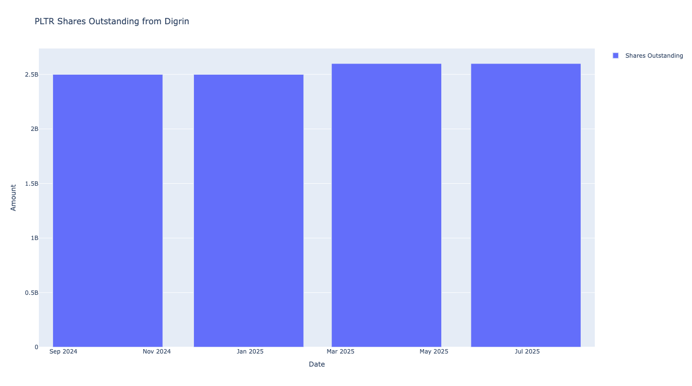
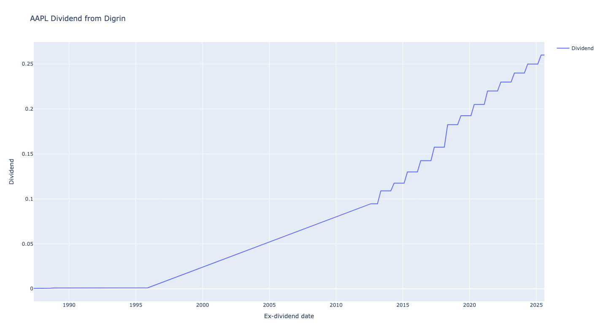
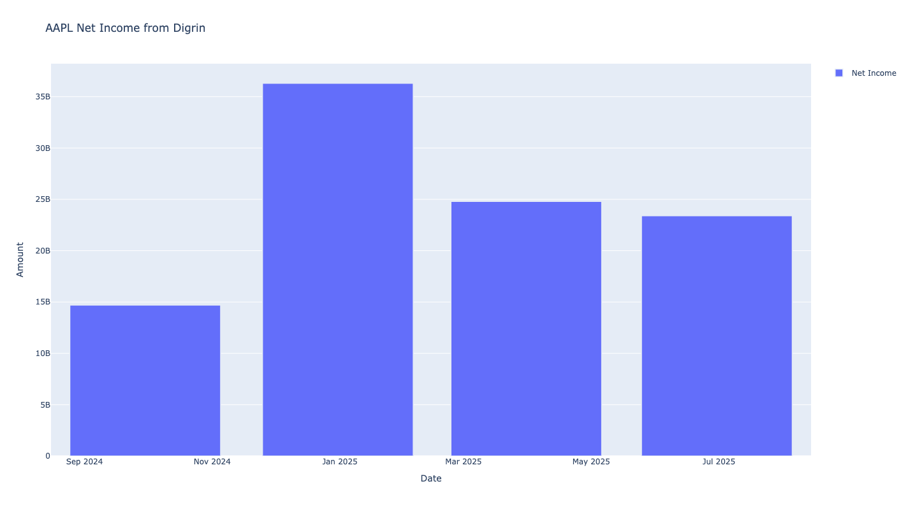
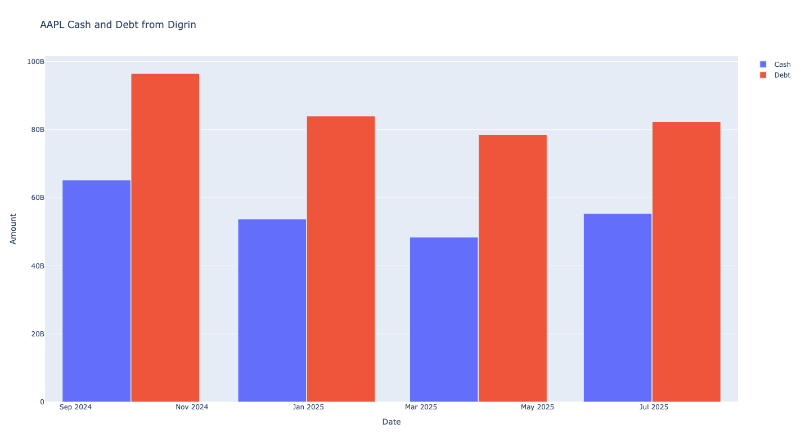

Digrin Plots
===============

Number of Shares Outstanding Chart
-----------------------------------

Creates an interactive line chart showing the number of shares outstanding over time.

**Input:** 
    - ``show_plot`` (bool, optional): Whether to display the plot. Default is True.

**Output:** 
    - Returns a plotly line or bar chart object (``px.line`` or ``px.bar``).

.. code-block:: python

    from stockdex.ticker import Ticker

    ticker = Ticker(ticker="PLTR")
    result = ticker.plot_digrin_shares_outstanding()

**Results:**

Price Chart
-----------------------------------

Creates an interactive chart displaying stock price movements over time.

**Input:** 
    - ``show_plot`` (bool, optional): Whether to display the plot. Default is True.

**Output:** 
    - Returns a plotly line or bar chart object (``px.line`` or ``px.bar``).

.. code-block:: python

    from stockdex.ticker import Ticker

    ticker = Ticker(ticker="AAPL")
    result = ticker.plot_digrin_price()

**Results:**

.. image:: ../../images/digrin_plots/plot_digrin_price_AAPL.png
   :alt: Sankey chart for AAPL stock
   :align: center
   :width: 80%
   :class: rounded

Dividend Chart
--------------

Creates an interactive chart showing dividend payments and trends over time.

**Input:** 
    - ``show_plot`` (bool, optional): Whether to display the plot. Default is True.

**Output:** 
    - Returns a plotly line or bar chart object (``px.line`` or ``px.bar``).

.. code-block:: python

    from stockdex.ticker import Ticker

    ticker = Ticker(ticker="AAPL")
    result = ticker.plot_digrin_dividend()

**Results:**

    

Assets vs Liabilities Chart
----------------------------

Creates an interactive chart comparing total assets versus total liabilities over time.

**Input:** 
    - ``show_plot`` (bool, optional): Whether to display the plot. Default is True.

**Output:** 
    - Returns a plotly line or bar chart object (``px.line`` or ``px.bar``).

.. code-block:: python
    from stockdex.ticker import Ticker

    ticker = Ticker(ticker="AAPL")
    result = ticker.plot_digrin_assets_vs_liabilities()

**Results:**

.. image:: ../../images/digrin_plots/plot_digrin_assets_vs_liabilities_AAPL.png
   :alt: Sankey chart for AAPL stock
   :align: center
   :width: 80%
   :class: rounded

Free Cash Flow Chart
----------------------------

Creates an interactive chart displaying free cash flow trends over time.

**Input:** 
    - ``show_plot`` (bool, optional): Whether to display the plot. Default is True.

**Output:** 
    - Returns a plotly line or bar chart object (``px.line`` or ``px.bar``).

.. code-block:: python
    from stockdex.ticker import Ticker

    ticker = Ticker(ticker="AAPL")
    result = ticker.plot_digrin_free_cash_flow()

**Results:**

.. image:: ../../images/digrin_plots/plot_digrin_free_cash_flow_AAPL.png
   :alt: Sankey chart for AAPL stock
   :align: center
   :width: 80%
   :class: rounded

Net Income Chart
----------------------------

Creates an interactive chart showing net income trends and profitability over time.

**Input:** 
    - ``show_plot`` (bool, optional): Whether to display the plot. Default is True.

**Output:** 
    - Returns a plotly line or bar chart object (``px.line`` or ``px.bar``).

.. code-block:: python
    from stockdex.ticker import Ticker

    ticker = Ticker(ticker="AAPL")
    result = ticker.plot_digrin_net_income()

**Results:**

Debt vs Cash Chart
----------------------------

Creates an interactive chart comparing debt levels against cash holdings over time.

**Input:** 
    - ``show_plot`` (bool, optional): Whether to display the plot. Default is True.

**Output:** 
    - Returns a plotly line or bar chart object (``px.line`` or ``px.bar``).

.. code-block:: python

    from stockdex.ticker import Ticker

    ticker = Ticker(ticker="AAPL")
    result = ticker.plot_digrin_cash_and_debt()

**Results:**

Expenses Chart
----------------------------

Creates an interactive chart displaying various expense categories and trends over time.

**Input:** 
    - ``show_plot`` (bool, optional): Whether to display the plot. Default is True.

**Output:** 
    - Returns a plotly line or bar chart object (``px.line`` or ``px.bar``).

.. code-block:: python

    from stockdex.ticker import Ticker

    ticker = Ticker(ticker="AAPL")
    result = ticker.plot_digrin_expenses()

**Results:**

.. image:: ../../images/digrin_plots/plot_digrin_expenses_AAPL.png
   :alt: Sankey chart for AAPL stock
   :align: center
   :width: 80%
   :class: rounded

Cost of Revenue Chart
----------------------------

Creates an interactive chart showing cost of revenue trends and efficiency metrics over time.

**Input:** 
    - ``show_plot`` (bool, optional): Whether to display the plot. Default is True.

**Output:** 
    - Returns a plotly line or bar chart object (``px.line`` or ``px.bar``).

.. code-block:: python

    from stockdex.ticker import Ticker

    ticker = Ticker(ticker="AAPL")
    result = ticker.plot_digrin_cost_of_revenue()

**Results:**

.. image:: ../../images/digrin_plots/plot_digrin_cost_of_revenue_AAPL.png
   :alt: Sankey chart for AAPL stock
   :align: center
   :width: 80%
   :class: rounded