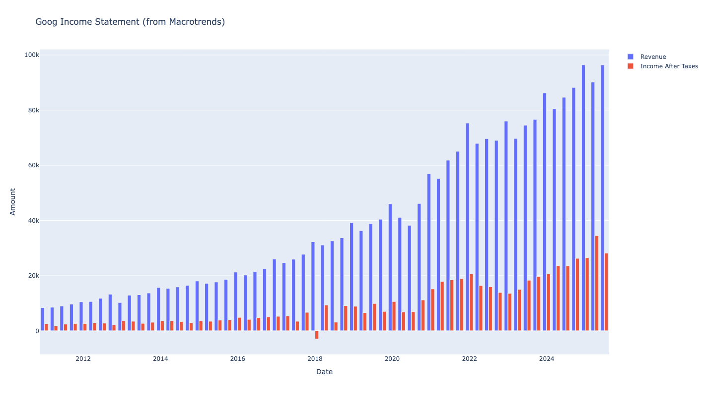
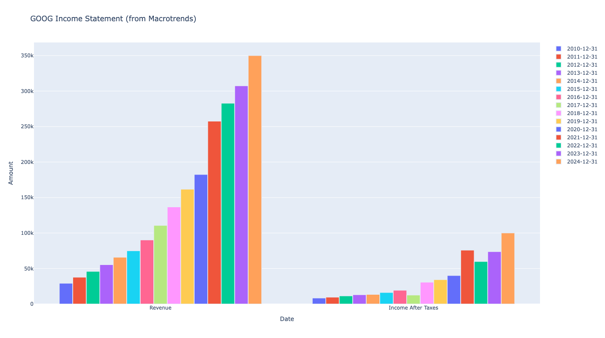
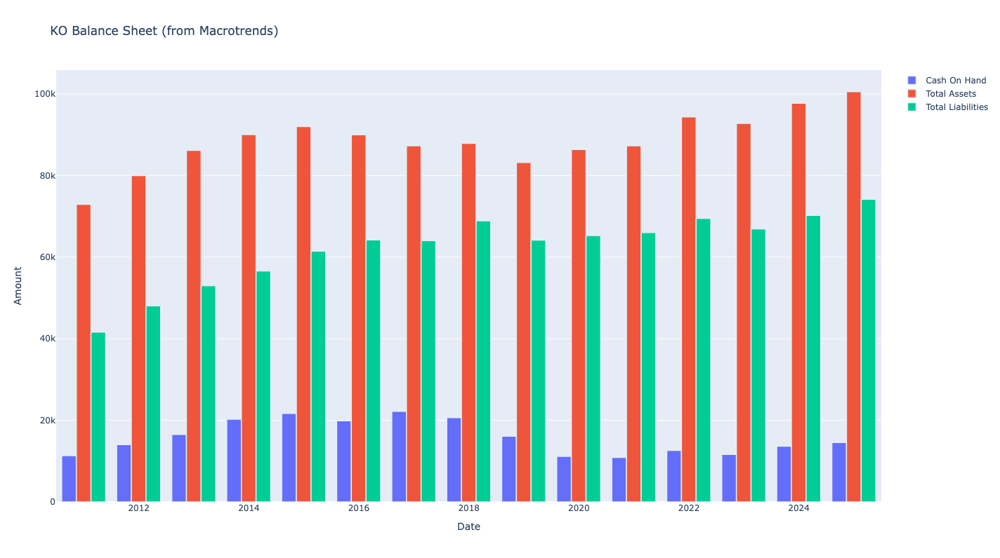
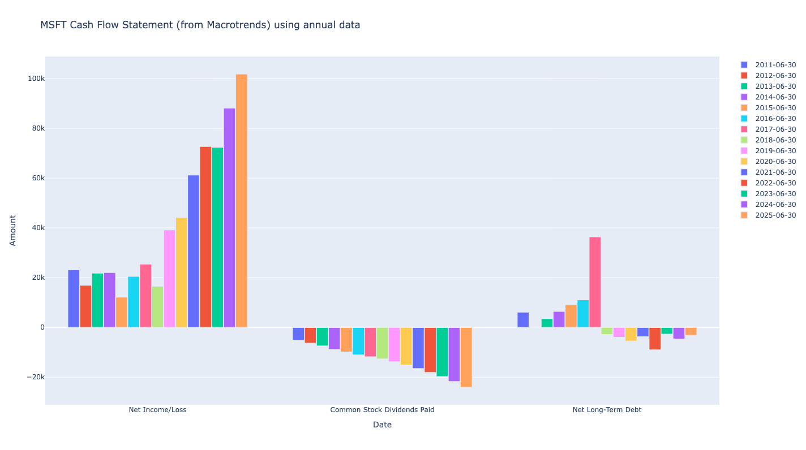

Macrotrends Plots
=================

This section contains interactive plotting functions that visualize financial data scraped from Macrotrends.com. These plots provide comprehensive views of income statements, balance sheets, and cash flow statements with customizable parameters for frequency, grouping, and field selection.

Income Statement Chart
------------------------

**Function:** ``plot_macrotrends_income_statement()``

Creates an interactive plot of income statement data for a given ticker from Macrotrends.

**Input Parameters:**
    - ``fields_to_include`` (*list*): Financial fields to include in the plot. Defaults to:
        - `Revenue` 
        - `Income After Taxes`
    - ``frequency`` (*str*): Data frequency - `annual` or `quarterly` (default: `annual`)  
    - ``group_by`` (*str*): Grouping method - `field` or `timeframe` (default: `timeframe`)
    - ``show_plot`` (*bool*): Whether to display the plot (default: `True`)

**Returns:** plotly express line or bar chart object

**Results Example 1: annual frequency**

.. code-block:: python

    from stockdex.ticker import Ticker

    ticker = Ticker(ticker="GOOG")
    result = ticker.plot_macrotrends_income_statement()

.. image:: ../../images/macrotrend_plots/plot_macrotrends_income_statement_GOOG.png
   :alt: Income Statement Chart for GOOG stock
   :align: center
   :width: 80%
   :class: rounded

**Results Example 2: quarterly frequency**

.. code-block:: python

    from stockdex.ticker import Ticker

    ticker = Ticker(ticker="GOOG")
    result = ticker.plot_macrotrends_income_statement(frequency="quarterly", show_plot=True)

**Results Example 3: group by field**

.. code-block:: python

    from stockdex.ticker import Ticker

    ticker = Ticker(ticker="GOOG")
    result = ticker.plot_macrotrends_income_statement(frequency="annual", show_plot=True, group_by="field")

Balance Sheet Chart
------------------------

**Function:** ``plot_macrotrends_balance_sheet()``

Creates an interactive plot of balance sheet data for a given ticker from Macrotrends.

**Input Parameters:**
    - ``fields_to_include`` (*list*): Financial fields to include in the plot. Defaults to:
        - `Cash On Hand`
        - `Total Assets` 
        - `Total Liabilities`
    - ``frequency`` (*str*): Data frequency - `annual` or `quarterly` (default: `annual`)
    - ``group_by`` (*str*): Grouping method - `field` or `timeframe` (default: `timeframe`)  
    - ``show_plot`` (*bool*): Whether to display the plot (default: `True`)

**Returns:** plotly express line or bar chart object

**Results Example 1: annual frequency**

.. code-block:: python

    from stockdex.ticker import Ticker

    ticker = Ticker(ticker="KO")
    result = ticker.plot_macrotrends_income_statement(frequency="annual", show_plot=True)

**Results Example 2: quarterly frequency**

.. code-block:: python

    from stockdex.ticker import Ticker

    ticker = Ticker(ticker="AMZN")
    result = ticker.plot_macrotrends_balance_sheet(frequency="quarterly", show_plot=True)

.. image:: ../../images/macrotrend_plots/plot_macrotrends_balance_sheet_AMZN_quarterly.png
   :alt: Balance Sheet Chart for AMZN stock
   :align: center
   :width: 80%
   :class: rounded

**Results Example 3: group by field**

.. code-block:: python

    from stockdex.ticker import Ticker

    ticker = Ticker(ticker="AMZN")
    result = ticker.plot_macrotrends_balance_sheet(frequency="annual", show_plot=True, group_by="field")

.. image:: ../../images/macrotrend_plots/plot_macrotrends_balance_sheet_AMZN_annual_field.png
   :alt: Balance Sheet Chart for AMZN stock
   :align: center
   :width: 80%
   :class: rounded

Cash Flow Chart
------------------------

**Function:** ``plot_macrotrends_cash_flow()``

Creates an interactive plot of cash flow statement data for a given ticker from Macrotrends.

**Input Parameters:**
    - ``fields_to_include`` (*list*): Financial fields to include in the plot. Defaults to:
        - `Net Income/Loss`
        - `Common Stock Dividends Paid` 
        - `Net Long-Term Debt`
    - ``frequency`` (*str*): Data frequency - `annual` or `quarterly` (default: `annual`)
    - ``group_by`` (*str*): Grouping method - `field` or `timeframe` (default: `timeframe`)
    - ``show_plot`` (*bool*): Whether to display the plot (default: `True`)

**Returns:** plotly express line or bar chart object

**Results Example 1: annual frequency**

.. code-block:: python

    from stockdex.ticker import Ticker

    ticker = Ticker(ticker="MSFT")
    result = ticker.plot_macrotrends_cash_flow(frequency="annual", show_plot=True)

.. image:: ../../images/macrotrend_plots/plot_macrotrends_cash_flow_MSFT_annual.png
   :alt: Cash Flow Chart for MSFT stock
   :align: center
   :width: 80%
   :class: rounded

**Results Example 2: quarterly frequency**

.. code-block:: python

    from stockdex.ticker import Ticker

    ticker = Ticker(ticker="MSFT")
    result = ticker.plot_macrotrends_cash_flow(frequency="quarterly", show_plot=True)

.. image:: ../../images/macrotrend_plots/plot_macrotrends_cash_flow_MSFT_quarterly.png
   :alt: Cash Flow Chart for MSFT stock
   :align: center
   :width: 80%
   :class: rounded

**Results Example 3: group by field**

.. code-block:: python

    from stockdex.ticker import Ticker

    ticker = Ticker(ticker="MSFT")
    result = ticker.plot_macrotrends_cash_flow(frequency="annual", show_plot=True, group_by="field")

