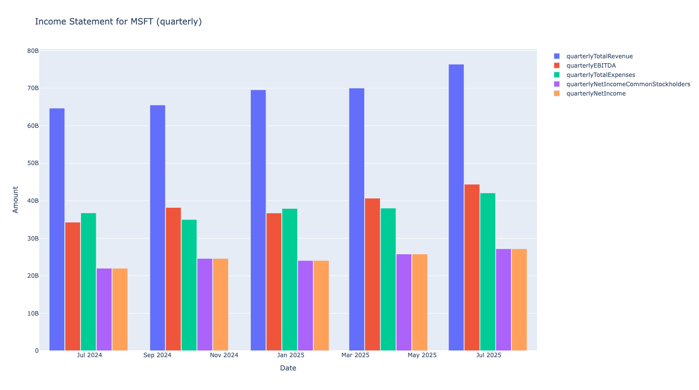
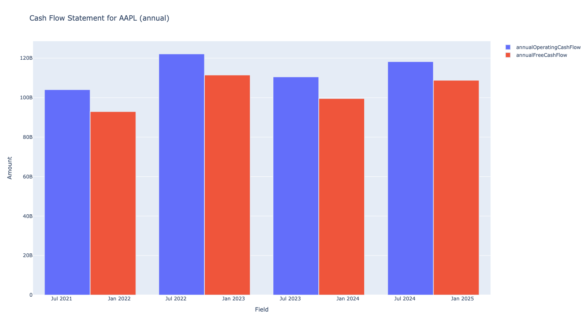
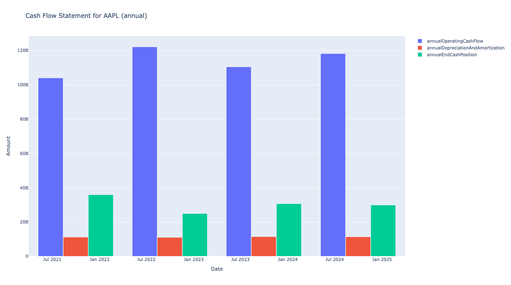
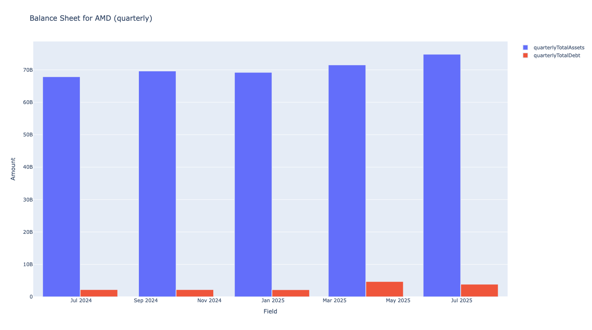
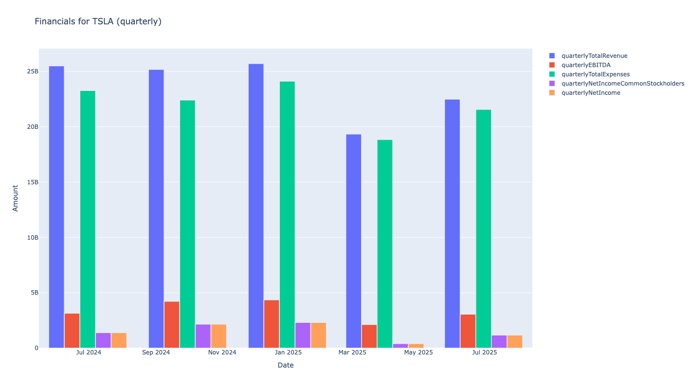
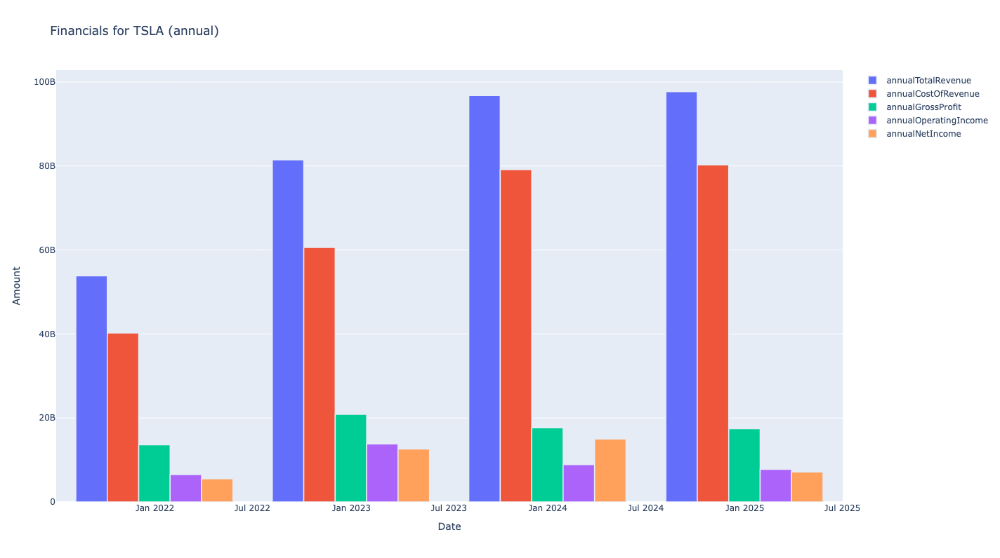

Yahoo API Plots
===============

This section contains interactive plotting functions that visualize financial data retrieved from Yahoo Finance API. These plots provide comprehensive analysis of income statements, cash flow statements, balance sheets, and general financial metrics with flexible time periods and customizable parameters.

Income statement chart
------------------------

**Function:** ``plot_yahoo_api_income_statement()``

Creates an interactive plot of income statement data for a given ticker using Yahoo Finance API.

**Input Parameters:**
    - ``frequency`` (*str*): Data frequency - `annual` or `quarterly` (default: `annual`)
    - ``period1`` (*datetime*): Start date for data retrieval (default: five years ago)
    - ``period2`` (*datetime*): End date for data retrieval (default: today)
    - ``group_by`` (*str*): Grouping method - `timeframe` or `field` (default: `timeframe`)
    - ``fields_to_include`` (*list*): Financial fields to include in the plot. Defaults to:
        - `TotalRevenue`, 
        - `EBITDA`, 
        - `TotalExpenses`, 
        - `NetIncomeCommonStockholders`, 
        - `NetIncome`
    - ``show_plot`` (*bool*): Whether to display the plot (default: `True`)

**Returns:** plotly express line or bar chart object

**Results Example 1: annual frequency**

.. code-block:: python

    from stockdex.ticker import Ticker

    ticker = Ticker(ticker="MSFT")
    result = ticker.plot_yahoo_api_income_statement(group_by="timestamp", frequency="annual")

.. image:: ../../images/yahoo_api_plots/plot_yahoo_api_income_statement_MSFT_annual_timestamp.png
   :alt: Income Statement Chart for MSFT stock
   :align: center
   :width: 80%
   :class: rounded

**Results Example 2: quarterly frequency**

.. code-block:: python

    from stockdex.ticker import Ticker

    ticker = Ticker(ticker="MSFT")
    result = ticker.plot_yahoo_api_income_statement(group_by="timestamp", frequency="quarterly")

.. image:: ../../images/yahoo_api_plots/plot_yahoo_api_income_statement_MSFT_quarterly_timestamp.png
   :alt: Income Statement Chart for MSFT stock
   :align: center
   :width: 80%
   :class: rounded

**Results Example 3: group by field**

.. code-block:: python

    from stockdex.ticker import Ticker

    ticker = Ticker(ticker="MSFT")
    result = ticker.plot_yahoo_api_income_statement(group_by="field", frequency="quarterly")

**Results Example 4: custom fields**

.. code-block:: python

    from stockdex.ticker import Ticker

    ticker = Ticker(ticker="MSFT")
    result = ticker.plot_yahoo_api_income_statement(
        group_by="field",
        frequency="annual",
        fields_to_include=[
            "TotalRevenue",
            "CostOfRevenue",
            "GrossProfit",
            "OperatingIncome",
            "NetIncome",
        ],
    )

.. image:: ../../images/yahoo_api_plots/plot_yahoo_api_income_statement_MSFT_annual_field_custom.png
    :alt: Income Statement Chart for MSFT stock
    :align: center
    :width: 80%
    :class: rounded

Cash Flow Statement Chart
--------------------------

**Function:** ``plot_yahoo_api_cash_flow()``

Creates an interactive plot of cash flow statement data for a given ticker using Yahoo Finance API.

**Input Parameters:**
    - ``frequency`` (*str*): Data frequency - `annual` or `quarterly` (default: `annual`)
    - ``period1`` (*datetime*): Start date for data retrieval (default: five years ago)
    - ``period2`` (*datetime*): End date for data retrieval (default: today)
    - ``group_by`` (*str*): Grouping method - `timeframe` or `field` (default: `timeframe`)
    - ``fields_to_include`` (*list*): Financial fields to include in the plot. Defaults to:
        - `OperatingCashFlow`, 
        - `FreeCashFlow`
    - ``show_plot`` (*bool*): Whether to display the plot (default: `True`)

**Returns:** plotly express line or bar chart object

**Results Example 1: annual frequency**

.. code-block:: python

    from stockdex.ticker import Ticker

    ticker = Ticker(ticker="AAPL")
    result = ticker.plot_yahoo_api_cash_flow(group_by="timestamp", frequency="annual")

**Results Example 2: quarterly frequency**

.. code-block:: python

    from stockdex.ticker import Ticker

    ticker = Ticker(ticker="AAPL")
    result = ticker.plot_yahoo_api_cash_flow(group_by="timestamp", frequency="quarterly")

.. image:: ../../images/yahoo_api_plots/plot_yahoo_api_cash_flow_AAPL_quarterly_timestamp.png
    :alt: Cash Flow Chart for AAPL stock
    :align: center
    :width: 80%
    :class: rounded

**Results Example 3: group by field**

.. code-block:: python

    from stockdex.ticker import Ticker

    ticker = Ticker(ticker="AAPL")
    result = ticker.plot_yahoo_api_cash_flow(group_by="field", frequency="quarterly")

.. image:: ../../images/yahoo_api_plots/plot_yahoo_api_cash_flow_AAPL_quarterly_field.png
    :alt: Cash Flow Chart for AAPL stock
    :align: center
    :width: 80%
    :class: rounded

**Results Example 4: custom fields**

.. code-block:: python

    from stockdex.ticker import Ticker

    ticker = Ticker(ticker="AAPL")
    result = ticker.plot_yahoo_api_cash_flow(
        group_by="field",
        frequency="annual",
        fields_to_include=[
            "OperatingCashFlow",
            "DepreciationAndAmortization",
            "EndCashPosition",
        ],
    )

Balance Sheet Chart
------------------------

**Function:** ``plot_yahoo_api_balance_sheet()``

Creates an interactive plot of balance sheet data for a given ticker using Yahoo Finance API.

**Input Parameters:**
    - ``frequency`` (*str*): Data frequency - `annual` or `quarterly` (default: `annual`)
    - ``period1`` (*datetime*): Start date for data retrieval (default: five years ago)
    - ``period2`` (*datetime*): End date for data retrieval (default: today)
    - ``group_by`` (*str*): Grouping method - `timeframe` or `field` (default: `timeframe`)
    - ``fields_to_include`` (*list*): Financial fields to include in the plot. Defaults to:
            - `TotalAssets`, 
            - `TotalDebt`
    - ``show_plot`` (*bool*): Whether to display the plot (default: `True`)

**Returns:** plotly express line or bar chart object

**Results Example 1: annual frequency**

.. code-block:: python

    from stockdex.ticker import Ticker

    ticker = Ticker(ticker="AMD")
    result = ticker.plot_yahoo_api_balance_sheet(group_by="timestamp", frequency="annual")

.. image:: ../../images/yahoo_api_plots/plot_yahoo_api_balance_sheet_AMD_annual_timestamp.png
    :alt: Balance Sheet Chart for AMD stock
    :align: center
    :width: 80%
    :class: rounded

**Results Example 2: quarterly frequency**

.. code-block:: python

    from stockdex.ticker import Ticker

    ticker = Ticker(ticker="AMD")
    result = ticker.plot_yahoo_api_balance_sheet(group_by="timestamp", frequency="quarterly")

**Results Example 3: group by field**

.. code-block:: python

    from stockdex.ticker import Ticker

    ticker = Ticker(ticker="AMD")
    result = ticker.plot_yahoo_api_balance_sheet(group_by="field", frequency="quarterly")

.. image:: ../../images/yahoo_api_plots/plot_yahoo_api_balance_sheet_AMD_quarterly_field.png
    :alt: Balance Sheet Chart for AMD stock
    :align: center
    :width: 80%
    :class: rounded

**Results Example 4: custom fields**

.. code-block:: python

    from stockdex.ticker import Ticker

    ticker = Ticker(ticker="AAPL")
    result = ticker.plot_yahoo_api_balance_sheet(
        group_by="field",
        frequency="annual",
        fields_to_include=[
            "TotalAssets",
            "Payables",
            "CurrentDebt",
            "Inventory",
            "Leases"
        ],
    )

.. image:: ../../images/yahoo_api_plots/plot_yahoo_api_balance_sheet_AAPL_annual_field_custom.png
    :alt: Balance Sheet Chart for AAPL stock
    :align: center
    :width: 80%
    :class: rounded

Financials Chart
------------------------

**Function:** ``plot_yahoo_api_financials()``

Creates an interactive plot of general financial data for a given ticker using Yahoo Finance API.

**Input Parameters:**
    - ``frequency`` (*str*): Data frequency - `annual` or `quarterly` (default: `annual`)
    - ``period1`` (*datetime*): Start date for data retrieval (default: five years ago)
    - ``period2`` (*datetime*): End date for data retrieval (default: today)
    - ``group_by`` (*str*): Grouping method - `timeframe` or `field` (default: `timeframe`)
    - ``fields_to_include`` (*list*): Financial fields to include in the plot. Defaults to:
        - `TotalRevenue`
        - `EBITDA`
        - `TotalExpenses`
        - `NetIncomeCommonStockholders`
        - `NetIncome`
    - ``show_plot`` (*bool*): Whether to display the plot (default: `True`)

**Returns:** plotly express line or bar chart object

**Results Example 1: annual frequency**

.. code-block:: python

    from stockdex.ticker import Ticker

    ticker = Ticker(ticker="TSLA")
    result = ticker.plot_yahoo_api_financials(group_by="timestamp", frequency="annual")

.. image:: ../../images/yahoo_api_plots/plot_yahoo_api_financials_TSLA_annual_timestamp.png
    :alt: Financials Chart for TSLA stock
    :align: center
    :width: 80%
    :class: rounded

**Results Example 2: quarterly frequency**

.. code-block:: python

    from stockdex.ticker import Ticker

    ticker = Ticker(ticker="TSLA")
    result = ticker.plot_yahoo_api_financials(group_by="timestamp", frequency="quarterly")

**Results Example 3: group by field**

.. code-block:: python

    from stockdex.ticker import Ticker

    ticker = Ticker(ticker="TSLA")
    result = ticker.plot_yahoo_api_financials(group_by="field", frequency="quarterly")

**Results Example 4: custom fields**

.. code-block:: python

    from stockdex.ticker import Ticker

    ticker = Ticker(ticker="TSLA")
    result = ticker.plot_yahoo_api_financials(
        group_by="field",
        frequency="annual",
        fields_to_include=[
            "TotalRevenue",
            "CostOfRevenue",
            "GrossProfit",
            "OperatingIncome",
            "NetIncome",
        ],
    )

